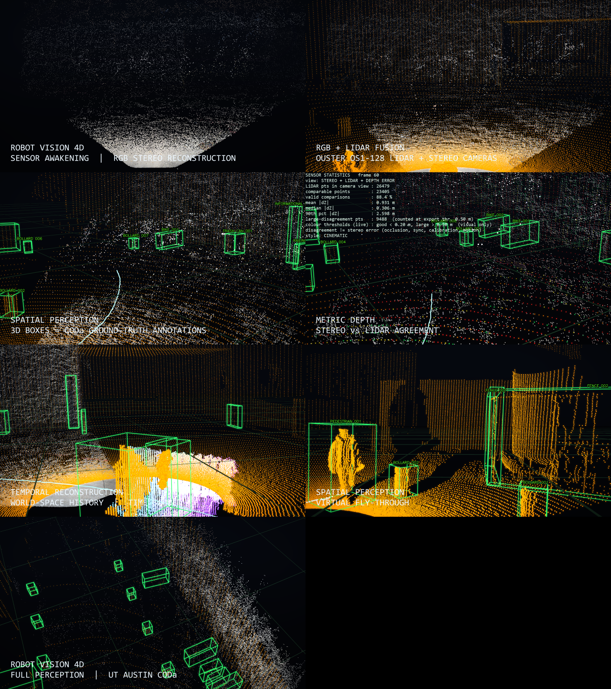
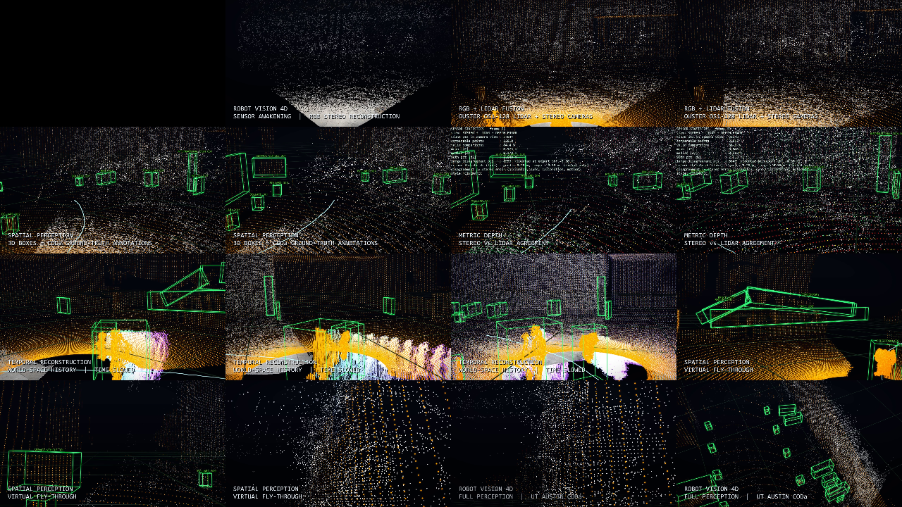
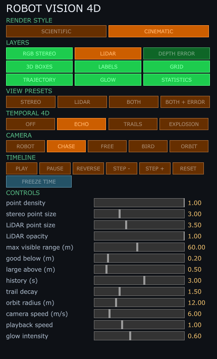
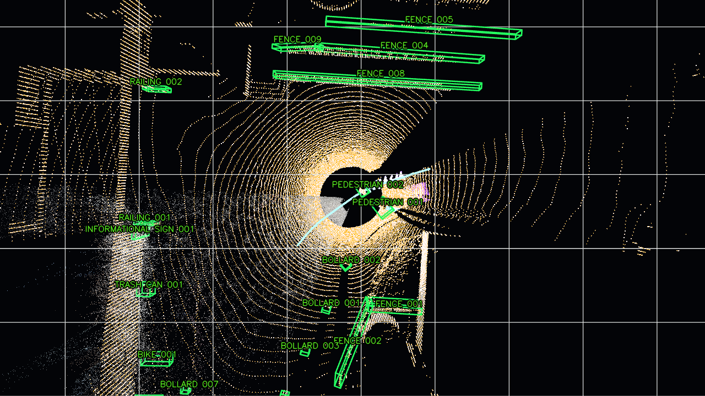
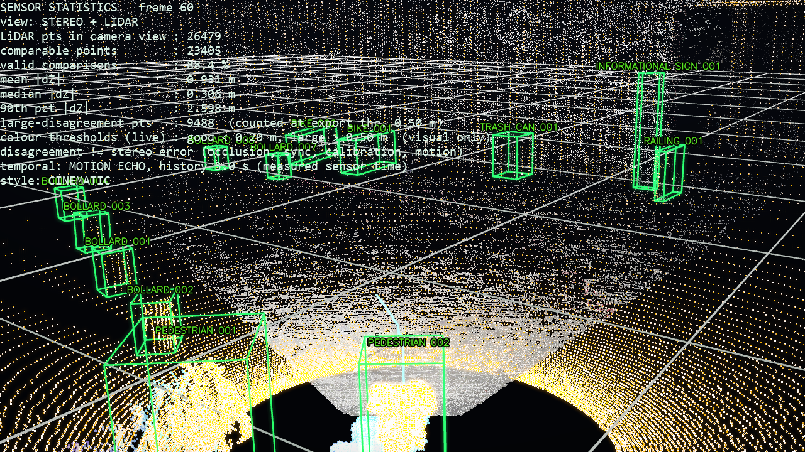
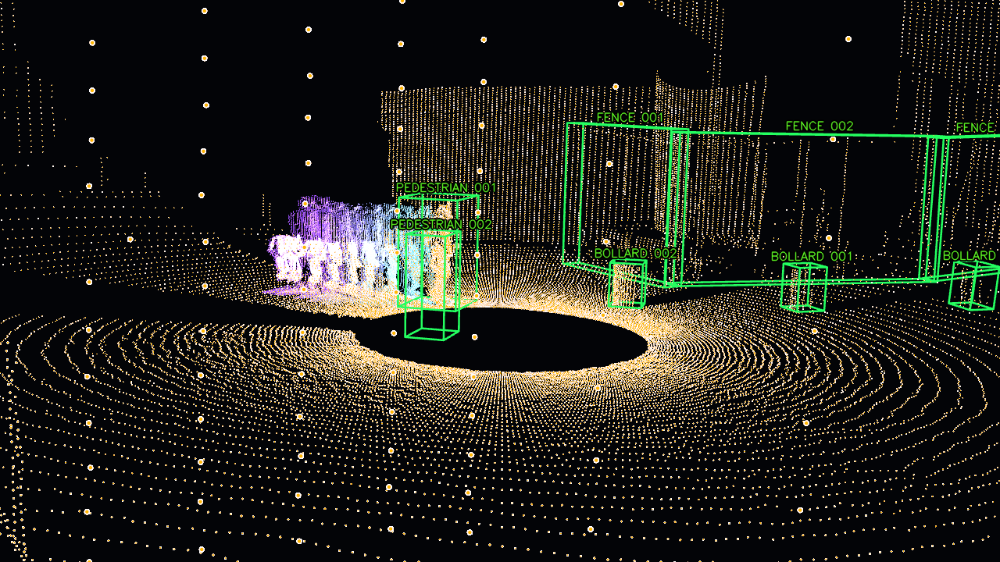

# ROBOT VISION 4D

Real-time visualisation of what an autonomous robot perceives: stereo-reconstructed RGB point cloud, LiDAR,
stereo-vs-LiDAR depth comparison and 3D boxes, from the UT Austin Campus Object Dataset (**CODa**, CC BY-NC-SA 4.0,
non-commercial). Built in Python (preprocessing) + TouchDesigner 2025.33230 (GPU point rendering).

## Status (honest)

| Stage | State |
|---|---|
| 1 Dataset inspection | **Done** on real sequence 0 data (`inspect_dataset.py`, `output/dataset_report.json`) |
| 2 Preprocessing | **Done, run on 166 real frames** (seq 0, frames 400-565, 16.6 s, 10.000 Hz measured). 102 tests pass (mostly synthetic geometry, plus real-data regression and live-path checks) |
| 3 Static scene in TD | **Done, rendered and visually checked** (robot POV shows stereo + LiDAR aligned) |
| 4 Animated replay | **Done, tested**: play / reverse / step follow measured timestamps (10 Hz sensor clock) |
| 5 3D boxes | **Done, rendered**: oriented green wireframes (12 edges, Line MAT 2 px) from CODa annotations, CODa instance IDs in labels (`PEDESTRIAN 001`); labels drawn with OpenCV into a Script TOP and projected with the live camera |
| 6 Depth disagreement | **Done, rendered**: view modes 1-4 (stereo / LiDAR / both / both + depth error); error class computed in the shader from exported |dZ| so the good/large thresholds are live; stats panel follows the scrubbed frame |
| Control values | `UI/main_controls` Constant CHOP holds view_mode, toggles, sizes, ranges, thresholds (no sliders/buttons yet) |
| 7 Temporal 4D | **Done, rendered**: 8 world-space history layers aged by MEASURED timestamps. Mode 1 Motion Echo (only points inside instances that really move: 2 pedestrians of 31 in seq 0), 2 Point Trails (whole cloud), 6 Time Explosion (artistic time axis, labelled as not measured; live scan stays unshifted). Mode 4 = timeline scrubber; Mode 5 = timeline FREEZE + any trail mode. Mode 3 (skeleton) deliberately omitted: no pose estimator, nothing invented. Verified coherent from two very different cameras |
| 8 Cameras | **Done, rendered**: one driven render camera (`CAMERA_SYSTEM/main_camera`) fed by five pose generators selected with `camera_mode` 1-5 (robot POV at the sensor pose with the real camera's 77.0 deg fov / chase / free-fly / bird's-eye / cinematic orbit that hands over from the robot to each MOVING object on the data clock). Mode switches blend pose (slerp + lerp, smootherstep, `cam_blend_s`); measured chase to bird's-eye: monotone, no jump. Plus `WORLD_REFERENCE`: snapped fading ground grid and the robot trajectory. Deviation from the spec's four named camera COMPs: one driven camera, not four, so transitions are plain pose blends |
| 9 UI, glow, render styles | **Done, rendered and click-tested**: `UI/panel` (dark 430x712 px container, openable as a window via `UI/control_window`): render style radio, 9 layer checkboxes, 4 view presets, temporal / camera radios, PLAY PAUSE REVERSE STEP- STEP+ RESET + FREEZE TIME, 13 sliders with value readouts. Widgets are the source of truth; `main_controls` channels bind to them by expression. **47/47 scripted widget checks pass** (`tools/ui_drive.py`, real `click(value, left=True)` through the callbacks). Glow + vignette + haze live in one GLSL TOP; SCIENTIFIC style bypasses all of it (post uniforms are exactly 0), CINEMATIC adds a soft-limited glow on bright saturated pixels only |
| 10 Cinematic video | **Done, rendered, decoded and checked** (30 s cut published on the release; a 45 s cut also rendered locally): `output/videos/robot_vision_4d.mp4` (**45.000 s**, 1350 frames, 30 fps, H.264 yuv420p, **1280x720**, 8x MSAA, 236 MB at CRF 16) plus a lighter `_share.mp4` (113 MB); the spec's exact 30 s cut is kept as `_30s.mp4`. Seven scenes in the specified order and proportions (stretched 1.5x), rendered frame-by-frame and deterministically from `video_director.py` through the same panel widgets; encoded with ffmpeg/libx264 |
| ROS 2 live mode (`optional_ros2/sensor_bridge.py`) | **Written; everything except the rclpy node is tested; the node itself has never run** (no ROS 2 / robot on this machine). Shares the exact per-frame code of the offline path (`preprocessing/frame_pipeline.py`, refactor verified bit-identical on real frames); decoding of PointCloud2/Image, pose composition, timestamp sync and the rolling export are unit-tested; `--selftest` replays real CODa frames through encode -> decode -> sync -> pipeline and matches the offline export (positions within 3.4e-5 m, depth-error values and colours exactly equal) |
| 4K / 1080p export | **Not possible** under the non-commercial TouchDesigner licence (1280x720 cap) |
| RAFT-Stereo | Wrapper written, **never run** (no CUDA GPU, no checkpoint). Falls back to SGBM |
| ROS 2 live mode | **Not built** |

Not verified: 1080p/30 fps (the laptop has an integrated GPU, non-commercial TD caps output at 1280 px), anything on
sequences other than 0, the remaining ~120 frames (download in progress/throttled).

## Facts established from the real data (these differ from the docs)

- Rectified images are **`.png`**, not `.jpg`.
- `calib_cam1_intrinsics.yaml` stores `P[0,3]` **1000x too small** (-0.151 -> 0.000196 m). Baseline is taken from
  `|T|` of `calib_cam0_to_cam1` (0.19637 m); the loader cross-checks and refuses inconsistent files.
- `3d_comp` LiDAR scans have **intensity = 0** everywhere (so LiDAR brightness is uniform for now). `3d_raw` has not been
  fetched yet; use `--include-raw` to get it.
- `calib_os1_to_cam0.yaml` also contains a direct 3x4 `projection_matrix`. It equals `P_rect @ [R_rect*R | R_rect*t]`
  of the extrinsic to relative error 0.0, which **verifies that R_rect must be applied** (without it: 2.4 % error).
- Pose rows are **`T_world_os1`**: at 60 frames apart the correct reading gives 0.46 m mean NN distance vs 2.01 m inverted.
- Measured sensor rate 9.9991 Hz, max gap 0.104 s. Sequence 0 has 8213 frames; annotated frames are contiguous here.
- Median stereo-vs-LiDAR |dZ| is ~0.25-0.31 m per frame with ~22k comparable points (SGBM, these thresholds are only
  visualisation defaults, not sensor specs).

## Gallery








All imagery is derived from the UT Austin Campus Object Dataset (CODa, CC BY-NC-SA 4.0): see [NOTICE.md](NOTICE.md).
**Video:** the 30 s cinematic cut (H.264, 1280x720, 30 fps) is attached to the [v1.0 release](https://github.com/Utsav92/ROBOT_VISION_4D/releases/tag/v1.0) (`robot_vision_4d_30s.mp4`, 167 MB, or the lighter `_30s_share.mp4`, 82 MB) rather than stored in the repository. A longer 45 s cut can be re-rendered locally (see below); it is not published.

## Open the project (quick start)

Double-click `touchdesigner/Robot_Vision_4D.toe`, or run `python touchdesigner/tools/tdrun.py touchdesigner/tools/open_preview.py` against
a running instance. That tiles the output window (930x523) and the control panel (430x712) side by side for a 1366x768 screen and
starts playback. Opening the .toe by double-click starts a second instance that steals the bridge port; the bridge-driven
tools (`tdrun.py`, `ui_drive.py`, `export_video.py`) need an instance launched from `touchdesigner/tools/mcp_webserver_base.tox`.
Note: on a 768 px-high screen the panel's last slider row can sit behind the taskbar.

## Run it

```
pip install -r requirements.txt
python -m preprocessing.fetch_coda_subset --sequence 0 --frames 200 --plan    # sizes only
python -m preprocessing.fetch_coda_subset --sequence 0 --frames 200 --max-gb 3  # resumable range download
python -m preprocessing.inspect_dataset --root data/coda --sequence 0 --check-poses
python -m preprocessing.calibration_overlay --root data/coda --sequence 0 --frame 430
python -m preprocessing.process_sequence --config config.yaml
python -m pytest tests -q
```

TouchDesigner (the bridge needs `modules/` + `import_modules.py` next to the tox *before* launch, otherwise every
route 404s):

```
touchdesigner/tools/mcp_webserver_base.tox      # launch TD with this file, bridge on :9981
python touchdesigner/tools/tdrun.py touchdesigner/tools/run_build.py   # builds /project1/ROBOT_VISION_4D
python touchdesigner/tools/tdrun.py touchdesigner/tools/snap.py        # saves a render to output/screenshots
python touchdesigner/tools/tdrun.py touchdesigner/tools/pov.py         # robot-POV render
```

Or inside any TD: `RV4D_DIR=r'...'; exec(open(RV4D_DIR+r'\touchdesigner\build_project.py').read())`.
Playback: `op('/project1/ROBOT_VISION_4D/DATA_INPUT/timeline').module.play()` / `.reverse()` / `.pause()` / `.step(n)` /
`.scrub_to_frame(i)` / `.set_speed(x)` / `.freeze()`.

## Architecture

`preprocessing/` writes per frame (world frame, TouchDesigner axes: x right, y up, z toward viewer):
`lidar_xyz`, `lidar_attr` (intensity, error class, abs/rel error), `stereo_xyz`, `stereo_rgb`, `boxes`, `pose`.
TD loads them with Script TOPs into float textures; one **Grid SOP -> Convert (particles)** per cloud; the GLSL MAT vertex
shader samples position/colour textures per vertex (one draw call per cloud, no per-point CPU work).
Defaults: 65,536 LiDAR points and 139,536 stereo points per frame.

Axis conversion (`preprocessing/coords.py`, determinant +1, tested): LiDAR forward/left/up -> TD -z/-x/+y.

## Live robot mode (Mode B) - read this before trusting it

```
python optional_ros2/sensor_bridge.py --calib data/coda/calibrations/0 --out output/live     --left /stereo/left/image_rect --right /stereo/right/image_rect --lidar /ouster/points --odom /odom
python optional_ros2/sensor_bridge.py --selftest      # no ROS needed
```
Then point the renderer at `output/live` (store `data_dir` on `DATA_INPUT`) and call `timeline.refresh_live()` periodically.
The renderer is unchanged: the bridge writes the same `.npy`/`manifest.json` frames, with an atomic manifest so a reader never
sees a torn file. Differences in live mode: no ground-truth boxes, so no labels and no Motion Echo.

What is verified: message decoding (padding, extra fields, endianness, integer reflectivity, strides, five image encodings),
odometry/pose maths, LiDAR-triggered timestamp matching (waits for late streams, rejects >50 ms, drops stale scans,
latest-only), a live session writing frames, the loader following a growing manifest, and the real-data selftest.
What is NOT verified: the rclpy node (subscriptions, QoS, `message_filters`-free timer loop), a real Ouster/stereo driver, TF/odom
frame conventions on a real robot, raw-image rectification on real images, and TouchDesigner following a running bridge.
Assumptions: organised 128x1024 clouds, odometry = pose of the robot BASE (T_world_os1 = T_world_base @ T_base_os1).
Throughput: CPU StereoSGBM costs ~2 s per frame on this machine, so live mode would process roughly one set in four and
drop the rest (it always works on the newest set); real time needs a GPU stereo backend (RAFT-Stereo, also untested here).

## Cinematic video

**Published: the 30 s cut** (the brief's exact timing): 30.000 s, 900 frames, 30 fps, H.264 yuv420p, 1280x720, 8x MSAA - on the
[v1.0 release](https://github.com/Utsav92/ROBOT_VISION_4D/releases/tag/v1.0) as `robot_vision_4d_30s.mp4` (167 MB, CRF 16) and
`robot_vision_4d_30s_share.mp4` (82 MB, CRF 24). The project can also render a **45 s** cut (the same storyboard stretched by
1.5x via `video_director.SCALE`; 236 MB), which was rendered and verified locally but is not published. The scene table below
gives the 45 s times; for the 30 s cut divide by 1.5 (0-3, 3-6, 6-10, 10-14, 14-20, 20-26, 26-30 s).

Re-render: `python touchdesigner/tools/export_video.py --full` (needs the TouchDesigner bridge up; ~11 min for 1350 frames,
needs ~1.5 GB of free disk for the intermediate PNGs), or `--preview 45 120 240 ...` for single frames. Change
`SCALE` in `touchdesigner/video_director.py` for another length. Frames are saved as PNG then encoded with ffmpeg (OpenCV's
own H.264 encoder fails on this machine; a full ffmpeg build with libx264 is on PATH).

| Scene | Time (45 s cut) | What is shown |
|---|---|---|
| 1 Sensor awakening | 0-4.5 s | black -> RGB stereo points scatter in (density 2 % -> 100 %), data held at a still moment |
| 2 LiDAR activation | 4.5-9 s | orange LiDAR fades in |
| 3 Boxes | 9-15 s | boxes + labels reveal outward from the robot (range 2 -> 40 m), grid, trajectory |
| 4 Depth intelligence | 15-21 s | LiDAR recoloured by stereo agreement, statistics panel |
| 5 4D motion | 21-30 s | recorded time slowed to 0.2x; Motion Echo then Point Trails; camera orbits the pedestrians |
| 6 Fly-through | 30-39 s | camera detaches and flies a spline between the objects |
| 7 Full perception | 39-45 s | pull back to a wide overhead view, fade to black |

Overlays: ROBOT VISION 4D, RGB + LIDAR FUSION, METRIC DEPTH, SPATIAL PERCEPTION, TEMPORAL RECONSTRUCTION. Honesty notes
printed in the video itself: the boxes are labelled "CODa GROUND-TRUTH ANNOTATIONS" (they are not detections), and the
artistic Time Explosion mode is never used, so every drawn position is a measured one.

Caveats: the recording is only 16.6 s long, so the video replays recorded data from t = 2.0 s to 16.4 s. At 45 s the
per-scene data speeds are 0 / 0.13 / 0.33 / 0.5 / 0.2 / 0.67 / 0.17 x, i.e. it is slow motion almost throughout (time slowing is
part of the brief, but the longer cut stretches it further). Resolution is 1280x720, not the specified 1920x1080: the
non-commercial TouchDesigner licence caps output. Dense point clouds shimmer as the camera moves (median frame-to-frame
difference ~22/255), which is also why the files are large.
Verified by decoding the 45 s MP4: 1350 frames, first frame black, last nearly black, no frozen frames, no sudden jumps.
Not verified: playback in other players/devices, and the video has no audio.

Choreography bugs the tests caught while building it: the fly-through ended aimed at the sky (look-ahead point landed on
the camera), and scene hand-overs whipped the camera at 25-34 m/s because scenes did not start where the previous ended.

## Performance (measured, not promised)

Hardware: Windows laptop, integrated GPU, 16 GB RAM, non-commercial TouchDesigner (render capped at 1280x720, 4x MSAA).
166 frames, 139,536 stereo + 65,536 LiDAR points + 8 history layers. Frame rate = how often my per-frame tick runs
(`tools/fps.py`), measured on a freshly started TouchDesigner with nothing else running:

| State | frames/s |
|---|---|
| paused (cinematic, echo, chase) | 60 (vsync cap) |
| playing, cinematic, Motion Echo | 19.5 |
| playing, cinematic, Point Trails (8 full-cloud layers) | 18.0 |
| playing, scientific, no temporal layers | 23.4 |

**This is below the 30 fps target during playback.** Before optimisation the same playing states measured 4.3 / 3.2 / 7.6.
What helped: precomputed echo arrays, a byte-budgeted frame cache with background prefetch, a label overlay that skips
unchanged frames (20 ms -> 2 ms), a 5x5 instead of 9x9 glow kernel. GPU draw cost is small (render ~14 ms with everything
on); the remaining cost is Python on each sensor-frame change (box line generation ~8 ms, 8 history uploads ~2-4 ms each,
24+ per-frame uniform expressions). Next options: batched uniform expression, compact echo textures, half-resolution glow,
GPU-side history ring buffer. **Measurements are noisy when memory is tight**: after hours of rebuilds TouchDesigner grew
to 3 GB private memory, Windows compressed ~2 GB, and the same states measured 3-17 fps; a restart fixed it. 1080p/60 and
4K were not measured at all.

## Camera validation

- Pure-numpy pose math is unit-tested (orthonormal look-at incl. straight-down, quaternion round-trip and slerp against
  scipy, chase behind/above in heading and ignoring pitch, orbit radius/height/loop closure, eased cinematic hand-over,
  free-fly movement/yaw/pitch clamp, grid snapping, ground-height estimate).
- In TouchDesigner: chase to bird's-eye over 1 s sampled at 50 ms: progress 0.10 / 0.50 / 0.89 / 1.00 at 0.25 / 0.5 /
  0.75 / 1.0 s, monotone. Entering free-fly from the orbit: 0.000 m jump; 10 forward inputs at speed 6 moved 6.06 m exactly
  along the view direction.
- **Real keyboard and mouse input is NOT verified** (I can only inject synthetic input through the bridge). Channels:
  Keyboard In `kw ka ks kd kq ke kshift`, Mouse In `tx ty lbutton wheel`; the mouse-look scale (3.0) and wheel speed
  factor (1.25 per notch) are untuned guesses. Keyboard In only sees keys while the TouchDesigner window has focus.
- Robot trajectory: 114 poses, 10.6 m in 11.4 s (0.93 m/s). Ground estimate -1.46 m (5th percentile of nearby LiDAR
  heights), used only to place the grid.

## Temporal validation (real data; first run 114 frames, reconfirmed on 166 frames = 16.6 s: still exactly 2 of 42 identified instances move)

- Moving-instance detection: world-frame box-centre displacement >= 1 m (config `temporal.moving_min_disp_m`); 2 of 31
  identified instances qualify (`Pedestrian:1`, `Pedestrian:2`); static fences/bollards/signs are excluded even though the
  robot moves.
- 95-99 % of the exported "moving" points lie inside their own frame's box bounds (the remainder is the 0.1 m margin shell).
- Pedestrian point-cluster centroids travel 0.7-1.0 m/s, smoothly, over 11 s in world coordinates: the pose-based
  history is spatially coherent.
- Layer ages come from `timestamps` (unit-tested with a deliberate sensor dropout), not from frame counts.
- Cost: 8 layers x 65,536 points (~0.5 M extra points) plus 8 Script TOP uploads on each sensor-frame change. Frame rate
  was NOT measured.

## Depth-agreement finding (frame 30, SGBM, CPU)

Median |dZ| 0.31 m, mean 1.18 m, 90th percentile 3.07 m; 80 % of in-view LiDAR points are comparable and ~43 % of those
exceed 0.5 m. Agreement is good on near ground and poor at range. This reflects the baseline SGBM (and visualisation
thresholds), not a verdict on stereo in general; calibration, occlusion, sync and motion also contribute.

## Known issues / gotchas

- Saving the TD project to a NEW folder breaks the bridge (routes 404): copy `modules/` + `import_modules.py` next to the
  `.toe` first, and save to the same path afterwards. TD also writes a duplicate `.1.toe`; delete it.
- Camera COMP `worldTransform[r, c]` in this TD build is column-vector layout (translation in last column), `fov` is horizontal.
- Composite TOP "over": the FIRST input is the top layer. Cross-COMP TOP inputs need Select TOPs.
- The stats Text TOP does not recook on a CHOP change; the frame-change callback re-assigns its expression.

- Points near the camera are drawn large (size attenuation clamp); tune `uPointSize`/`uRefDist`.
- SGBM leaves holes on textureless ground; stereo cloud is sparser than LiDAR there.
- File-synced Text DAT modules lose their globals on reload; loader/timeline re-initialise lazily from component storage.
- Grid SOP has no "points" surface type; it must be converted (`totype=part`), otherwise the shader draws streaks.
- `tdu.Matrix` is row-vector (translation in the 4th row): transpose numpy poses before use.
- TD saves a duplicate `.1.toe`; delete it.
- Frustum culling of the displaced grids was not observed to be a problem (grid is 4000 m wide) but is unverified from all angles.

## Tests

`tests/` verify the **math** with synthetic geometry (calibration parsing, projection round-trips, disparity->depth with
offsets, synthetic SGBM recovery, pose slerp, timestamp matching, box geometry/rotation/identity handling, depth-error
classification and occlusion, exporter round-trip, handedness). They say nothing about CODa conventions; those were
checked on real frames as listed above. There is no benchmark data in this repo and none was fabricated.
